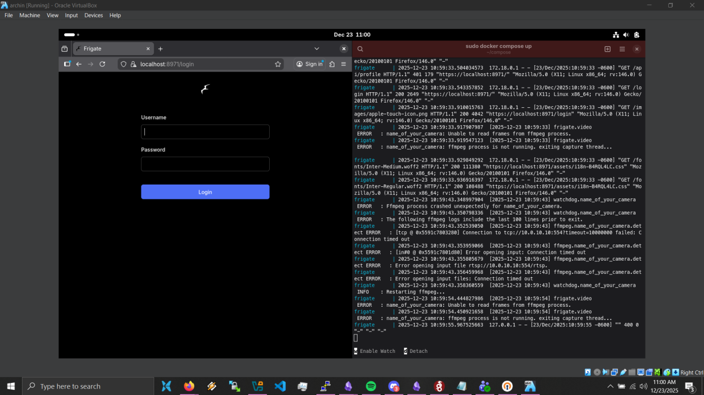

# Docker-File Setup.

I setup this docker compose file a while back as a part of a personal project- I compiled it by referencing the installation guides for a few different softwares, and basically cobbling together a few different docker-files.

This docker-file sets up the Frigate NVR software, as well as Double-Take, which is a UI that allows you to integrate facial recognition with the NVR.

Prior to running the docker-file, you will need to create the folders "config" and "media" in whichever directory you intend to run the docker-file in.




```

volumes:
  config:
  data:
  log:
  double-take:
  frigate:
  
networks:
  default:
    name: docker-network


services:
  frigate:
    container_name: frigate
    privileged: true # this may not be necessary for all setups
    restart: unless-stopped
    stop_grace_period: 30s # allow enough time to shut down the various services
    image: ghcr.io/blakeblackshear/frigate:stable
    shm_size: "2gb" # update for your cameras based on calculation above
    devices:
      - /dev/bus/usb:/dev/bus/usb # Passes the USB Coral, needs to be modified for other versions
      - /dev/apex_0:/dev/apex_0 # Passes a PCIe Coral, follow driver instructions here https://github.com/jnicolson/gasket-builder
      - /dev/video11:/dev/video11 # For Raspberry Pi 4B
      - /dev/dri/renderD128:/dev/dri/renderD128 # For intel hwaccel, needs to be updated for your hardware
    volumes:
      - /etc/localtime:/etc/localtime:ro
      - frigate/config:/config
      - frigate/storage:/media/frigate
      - type: tmpfs # Optional: 1GB of memory, reduces SSD/SD Card wear
        target: /tmp/cache
        tmpfs:
          size: 1000000000
    ports:
      - "8971:8971"
      - "5000:5000" # Internal unauthenticated access. Expose carefully.
      - "8554:8554" # RTSP feeds
      - "8555:8555/tcp" # WebRTC over tcp
      - "8555:8555/udp" # WebRTC over udp
    environment:
      FRIGATE_RTSP_PASSWORD: ""


  double-take:
    container_name: double-take
    image: skrashevich/double-take
    restart: unless-stopped
    volumes:
      - double-take:/.storage
    ports:
      - 3000:3000


```
