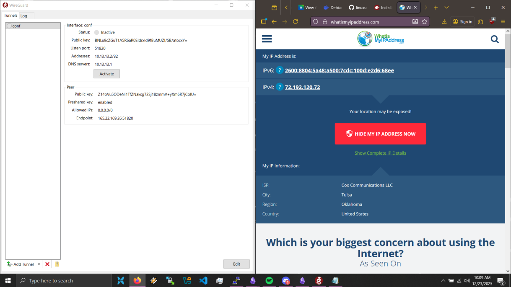
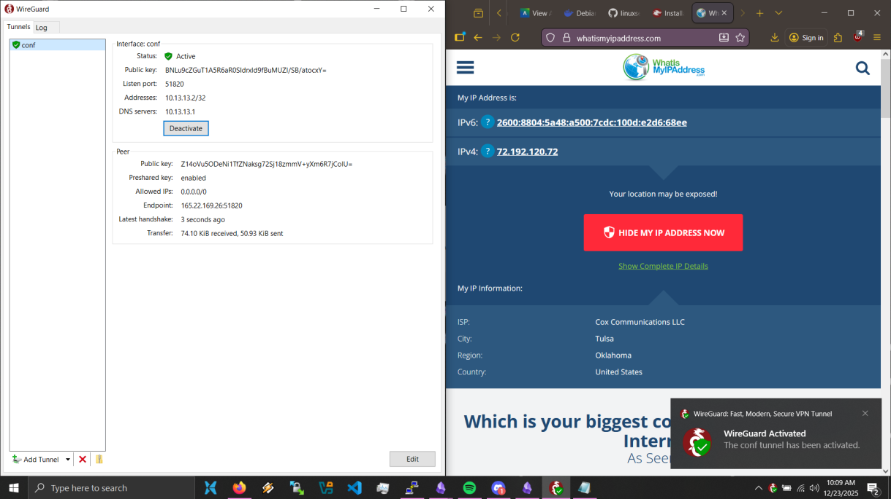

Create digitalocean droplet, provisioned at the $48.00/mo level because I've gotta use those credits somehow.

sudo apt update/upgrade

Install docker following the instructions on the official website

mkdir wireguard

touch compose.yml

copy the wireguard config from the wireguard website, remove server name and minimize usage of optional fields for simplicity.

spin it up, use the qr code to get connection info, copy it into a .conf file so I can import it directly into my wireguard client on my desktop, connect!

